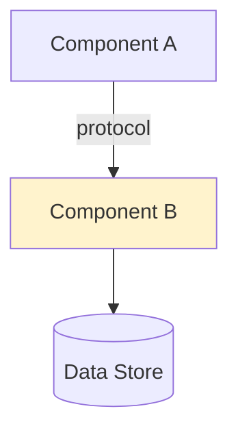
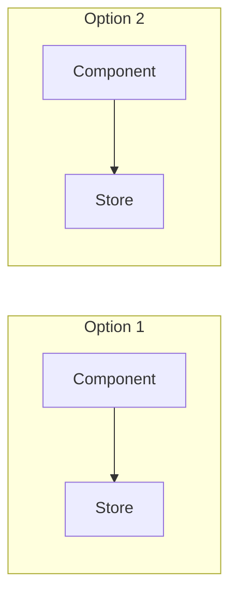
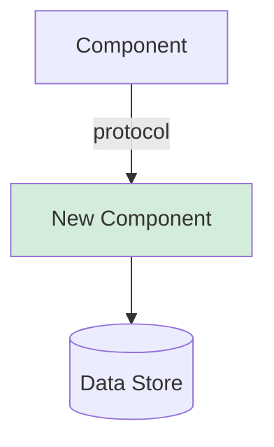

# ADR-{NN}: {Decision Title}

**Date:** {YYYY-MM-DD}
**Status:** Proposed | Accepted | Deprecated | Superseded by ADR-{NN}
**Scope:** {module|system|api|data|infra}
**Decision Makers:** {team/role}
**Technical Story:** {link to issue/ticket if applicable}
**Supersedes:** {ADR-XX or "—"}
**Related FDRs:** {FDR-XX, FDR-YY, ... or "—"}

---

## Context

{Why this decision needs to be made now. What changed, what broke, what's the trigger.
Reference specific code paths, metrics, or incidents. Cite file:line for relevant code.}

## Decision Drivers

- **{Driver}** — {specific, measurable statement with evidence}

Each driver must be specific and measurable. No vague statements.

## Current Architecture

{Description of how things work today, grounded in the actual codebase. Reference specific files, modules, and data flows.}

### Current State Diagram

### Existing System Contracts

<!-- ADR-REQ-1: Types, interfaces, and function signatures that existing code depends on.
     Test writers use this to verify their mocks match real code. -->

| Contract | Location | Signature / Shape | Must Not Break |
|----------|----------|-------------------|----------------|
| `{TypeName}` | `{file.ts}:{lines}` | `{exact signature or type shape}` | {Yes — reason / No} |

### Integration Point Signatures

<!-- ADR-REQ-2: Exact function signatures at module/service boundaries.
     These define the test surface for integration tests. -->

| Boundary | Function | Signature | Caller(s) | Contract |
|----------|----------|-----------|-----------|----------|
| {module boundary} | `{function_name}` | `{exact signature}` | `{file}:{line}` | {invariants this boundary enforces} |

### Invariants as Executable Assertions

<!-- ADR-REQ-3: Every architectural invariant expressed as a runnable assertion.
     Tests and runtime guards import these predicates. -->

| ID | Invariant | Assertion Expression | Scope |
|----|-----------|---------------------|-------|
| INV-{N} | {invariant description} | `assert {predicate}` or `expect({expr}).toBe({val})` | {module / system / boundary} |

## Considered Options

<!-- For each option, use this exact structure. Include 2-3 options. -->

### Option {N}: {Name} — {one-line summary}

{Technical description — how it works, what changes, what stays the same.}

**Pros:**
- {Pro with evidence or benchmark}

**Cons:**
- {Con with evidence or impact}

**Risks:**
- {Risk with likelihood and mitigation}

**Migration effort:** {Low|Medium|High}
- {What needs to change, estimated scope}

**Affected code paths:**
- `{file:line}` — {what changes}

## Comparison

| Criterion | Option 1: {Name} | Option 2: {Name} |
|-----------|-------------------|-------------------|
| **Performance** | {assessment with numbers} | {assessment} |
| **Security** | {assessment} | {assessment} |
| **Maintainability** | {assessment} | {assessment} |
| **Scalability** | {assessment with limits} | {assessment} |
| **Testability** | {assessment} | {assessment} |
| **Operability** | {assessment} | {assessment} |
| **Migration cost** | {time estimate} | {estimate} |
| **Team familiarity** | {assessment} | {assessment} |
| **Reversibility** | {assessment} | {assessment} |

### Comparison Diagram

## Decision

**Chosen option:** Option {N} — {Name}

**Rationale:**

{Why this option wins given the decision drivers and constraints. Be specific about which trade-offs matter most for THIS project.}

### Proposed Architecture

## Consequences

### Positive
- {Consequence with specific impact}

### Negative
- {Consequence with mitigation}

### Neutral
- {Side effect}

## Architectural Acceptance Criteria

<!-- System-level invariants the chosen architecture must preserve.
     Every AAC is a testable predicate. Downstream FDRs inherit and trace to these. -->

| ID | Invariant | Testable Predicate | Verification | Priority |
|----|-----------|-------------------|-------------|----------|
| AAC-{N} | {system-level invariant} | `{executable assertion}` | {unit test / integration test / metric / manual} | {P0/P1/P2} |

### New Public Interface Types

<!-- ADR-REQ-4: Canonical type definitions for new public interfaces.
     Both tests and implementation must import from the same source. -->

| Type Name | Definition | Exported From | Used By |
|-----------|-----------|---------------|---------|
| `{TypeName}` | `{type or interface definition}` | `{file_path}` | {tests, impl, both} |

### Module Boundary & File Path Map

<!-- ADR-REQ-5: Exact file paths for all modules involved in this decision.
     Tests use these for imports; implementation uses them for file creation. -->

| Module | Path | Exports | Depends On |
|--------|------|---------|-----------|
| `{module_name}` | `{exact/path/to/module}` | `{exported symbols}` | `{dependency paths}` |

## Implementation Plan

1. **{Step}** — {description with file references}

**Estimated effort:** {breakdown}
**Rollback plan:** {description}

**Verification criteria:**
- [ ] {criterion}

## Related Decisions

- {Link to prior/future ADR}

## References

- {Documentation, benchmarks, industry references}
