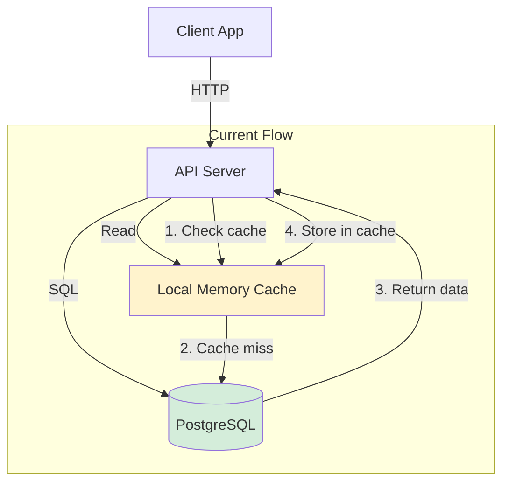
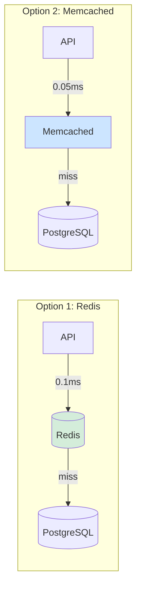
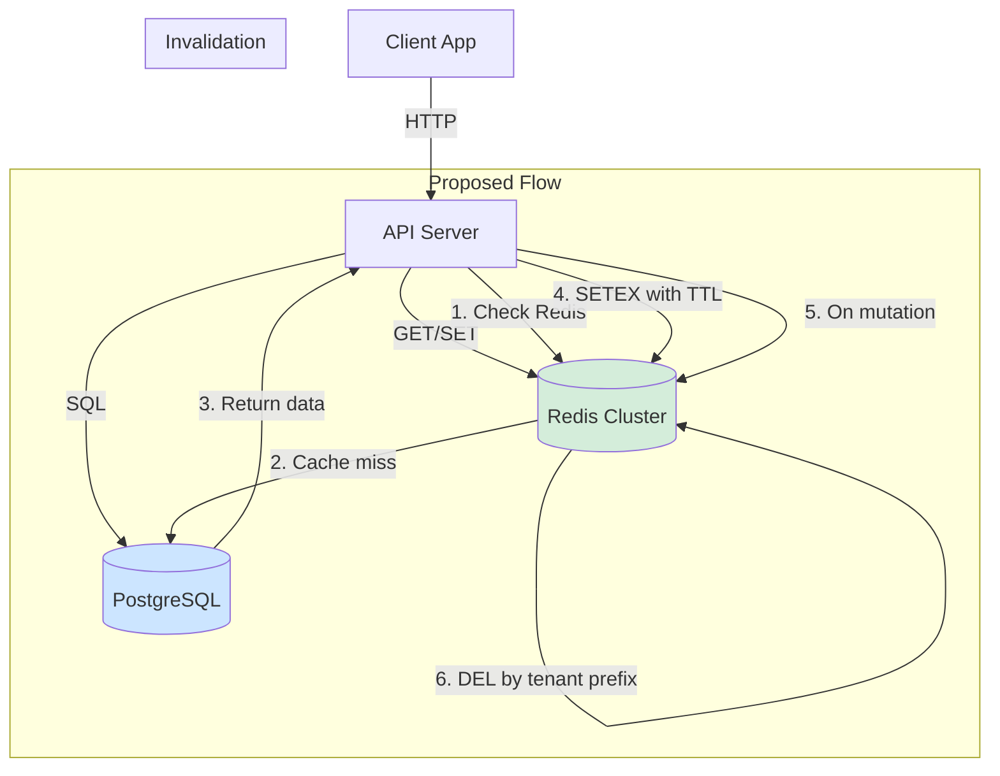

# ADR-{NN}: {Decision Title}

**Date:** {YYYY-MM-DD}
**Status:** Proposed | Accepted | Deprecated | Superseded by ADR-{NN}
**Scope:** {module|system|api|data|infra}
**Decision Makers:** {team/role}
**Technical Story:** {link to issue/ticket if applicable}
**Supersedes:** {ADR-XX or "—"}
**Related FDRs:** {FDR-XX, FDR-YY, ... or "—"}

---

## Context

{Why this decision needs to be made now. What changed, what broke, what's the trigger.
Reference specific code paths, metrics, or incidents. Cite file:line for relevant code.}

Example:
> The `/api/dashboard` endpoint averages 4.2s response time (SLA: 2s). Profiling shows
> 47 SQL queries per request due to N+1 in `views/dashboard.py:89`. The current
> `prefetch_related` only covers first-level relations.

## Decision Drivers

- **{Driver 1}** — e.g., "API response time exceeds 2s SLA for 10% of requests (Datadog P95: 4.2s)"
- **{Driver 2}** — e.g., "Current caching layer cannot be invalidated per-tenant (see `cache/manager.py:45`)"
- **{Driver 3}** — e.g., "Team has no Redis operational expertise (3 engineers, all PostgreSQL background)"

Each driver must be specific and measurable. No vague statements like "need better performance."

## Current Architecture

{Description of how things work today, grounded in the actual codebase. Reference specific files, modules, and data flows.}

### Current State Diagram

Mermaid source

### Existing System Contracts

<!-- ADR-REQ-1: Types, interfaces, and function signatures that existing code depends on.
     Test writers use this to verify their mocks match real code. -->

| Contract | Location | Signature / Shape | Must Not Break |
|----------|----------|-------------------|----------------|
| `{TypeName}` | `{file.ts}:{lines}` | `{exact signature or type shape}` | {Yes — reason / No} |

### Integration Point Signatures

<!-- ADR-REQ-2: Exact function signatures at module/service boundaries.
     These define the test surface for integration tests. -->

| Boundary | Function | Signature | Caller(s) | Contract |
|----------|----------|-----------|-----------|----------|
| {module boundary} | `{function_name}` | `{exact TS/Python signature}` | `{file}:{line}` | {invariants this boundary enforces} |

### Invariants as Executable Assertions

<!-- ADR-REQ-3: Every architectural invariant expressed as a runnable assertion.
     Tests and runtime guards import these predicates. -->

| ID | Invariant | Assertion Expression | Scope |
|----|-----------|---------------------|-------|
| INV-{N} | {invariant description} | `assert {predicate}` or `expect({expr}).toBe({val})` | {module / system / boundary} |

## Considered Options

### Option 1: {Name} — {one-line summary}

{Technical description — how it works, what changes, what stays the same. Be specific about implementation, not just concepts.}

**Pros:**
- {Pro with evidence} — e.g., "Redis SETEX supports TTL natively, eliminating custom expiry logic in `cache/manager.py:67-89`"
- {Pro with benchmark} — e.g., "Redis GET averages 0.1ms vs current in-memory 0.01ms, but enables multi-instance consistency"

**Cons:**
- {Con with evidence} — e.g., "Adds operational dependency: Redis cluster requires monitoring, failover config, and backup strategy"
- {Con with impact} — e.g., "Network round-trip adds ~0.5ms per cache hit (acceptable for our P95 target)"

**Risks:**
- {Risk} — e.g., "Redis connection pool exhaustion under load (likelihood: medium, mitigation: configure `maxclients` and connection pooling with `redis-py`)"

**Migration effort:** {Low|Medium|High}
- {What needs to change} — e.g., "Replace `LocalCache` class (1 file, ~200 lines), add Redis connection config, update Docker Compose"
- {Estimated scope} — e.g., "~2 days for core migration, ~1 day for testing, ~0.5 day for deployment config"

**Affected code paths:**
- `cache/manager.py:45-120` — replace `LocalCache` with `RedisCache`
- `config/settings.py:12` — add `REDIS_URL` configuration
- `docker-compose.yml` — add Redis service
- `tests/test_cache.py` — update cache tests for Redis

### Option 2: {Name} — {one-line summary}

{Same depth of analysis as Option 1. Every option gets equal treatment.}

**Pros:**
- {Pro with evidence}

**Cons:**
- {Con with evidence}

**Risks:**
- {Risk with likelihood and mitigation}

**Migration effort:** {Low|Medium|High}
- {Details}

**Affected code paths:**
- `{file:line}` — {what changes}

### Option 3: {Name} — {one-line summary} (if applicable)

{Same structure. Include a third option when there's a genuine third approach, not just to fill space.}

## Comparison

| Criterion | Option 1: {Name} | Option 2: {Name} | Option 3: {Name} |
|-----------|-------------------|-------------------|-------------------|
| **Performance** | {specific assessment with numbers} | {assessment} | {assessment} |
| **Security** | {specific assessment} | {assessment} | {assessment} |
| **Maintainability** | {assessment with reasoning} | {assessment} | {assessment} |
| **Scalability** | {assessment with limits} | {assessment} | {assessment} |
| **Testability** | {assessment} | {assessment} | {assessment} |
| **Operability** | {assessment — monitoring, debugging, incidents} | {assessment} | {assessment} |
| **Migration cost** | {Low/Med/High with time estimate} | {estimate} | {estimate} |
| **Team familiarity** | {honest assessment} | {assessment} | {assessment} |
| **Reversibility** | {how hard to undo} | {assessment} | {assessment} |

### Comparison Diagram

Mermaid source

## Decision

**Chosen option:** Option {N} — {Name}

**Rationale:**

{Why this option wins given the decision drivers and constraints. Be specific — don't say "best trade-off." Explain which trade-offs matter most for THIS project and why.}

Example:
> We choose Redis because per-tenant cache invalidation is the primary driver (Driver 2),
> and Redis supports key patterns (`SCAN`, `DEL` by prefix) while Memcached requires
> full flush. The 0.1ms latency overhead is acceptable against our 2s SLA target.
> The team's lack of Redis expertise (Driver 3) is mitigated by using managed Redis
> (ElastiCache), which handles failover and monitoring.

### Proposed Architecture

Mermaid source

## Consequences

### Positive
- {Consequence with specific impact} — e.g., "Dashboard P95 drops from 4.2s to ~0.8s (47 queries reduced to 1 cache hit + 2 queries on miss)"
- {Consequence} — e.g., "Per-tenant invalidation enables real-time data updates without full cache flush"

### Negative
- {Consequence with mitigation} — e.g., "Adds Redis as operational dependency (mitigated: use ElastiCache managed service)"
- {Consequence} — e.g., "Cache warming needed after Redis restart (mitigated: lazy population with short TTL)"

### Neutral
- {Side effect} — e.g., "Session storage could later move to Redis too, but that's a separate decision"

## Architectural Acceptance Criteria

<!-- System-level invariants the chosen architecture must preserve.
     Every AAC is a testable predicate. Downstream FDRs inherit and trace to these. -->

| ID | Invariant | Testable Predicate | Verification | Priority |
|----|-----------|-------------------|-------------|----------|
| AAC-{N} | {system-level invariant} | `{executable assertion}` | {unit test / integration test / metric / manual} | {P0/P1/P2} |

### New Public Interface Types

<!-- ADR-REQ-4: Canonical type definitions for new public interfaces.
     Both tests and implementation must import from the same source. -->

| Type Name | Definition | Exported From | Used By |
|-----------|-----------|---------------|---------|
| `{TypeName}` | `{type or interface definition}` | `{file_path}` | {tests, impl, both} |

### Module Boundary & File Path Map

<!-- ADR-REQ-5: Exact file paths for all modules involved in this decision.
     Tests use these for imports; implementation uses them for file creation. -->

| Module | Path | Exports | Depends On |
|--------|------|---------|-----------|
| `{module_name}` | `{exact/path/to/module}` | `{exported symbols}` | `{dependency paths}` |

## Implementation Plan

1. **{Step 1}** — e.g., "Add Redis connection config and `RedisCache` class (`cache/redis_backend.py`)"
2. **{Step 2}** — e.g., "Replace `LocalCache` usage in `views/dashboard.py` with `RedisCache`"
3. **{Step 3}** — e.g., "Add per-tenant key prefix and invalidation in `cache/invalidation.py`"
4. **{Step 4}** — e.g., "Update Docker Compose and deployment config for Redis service"
5. **{Step 5}** — e.g., "Update and run cache tests, add Redis integration tests"
6. **{Step 6}** — e.g., "Deploy to staging, run load test, verify P95 < 2s"

**Estimated effort:** {e.g., "3-4 days (2 dev + 1 test + 0.5 deploy + 0.5 buffer)"}

**Rollback plan:** {e.g., "Feature flag `USE_REDIS_CACHE=false` falls back to LocalCache. Remove Redis service from deployment. No data migration needed — cache is ephemeral."}

**Verification criteria:**
- [ ] Dashboard P95 < 2s under load test (100 concurrent users)
- [ ] Per-tenant invalidation works within 1s of mutation
- [ ] Cache hit rate > 80% after warm-up period
- [ ] All existing tests pass with Redis backend

## Related Decisions

- {Link to prior ADR} — e.g., "ADR-005: Chose PostgreSQL as primary database"
- {Link to future ADR} — e.g., "Future: Consider moving session storage to Redis (separate ADR)"

## References

- {Relevant documentation} — e.g., "[Redis documentation: Key expiration](https://redis.io/docs/manual/keyspace-notifications/)"
- {Benchmark data} — e.g., "Internal load test results: `docs/benchmarks/cache-comparison.md`"
- {Industry reference} — e.g., "[AWS ElastiCache best practices](https://docs.aws.amazon.com/AmazonElastiCache/latest/red-ug/best-practices.html)"
