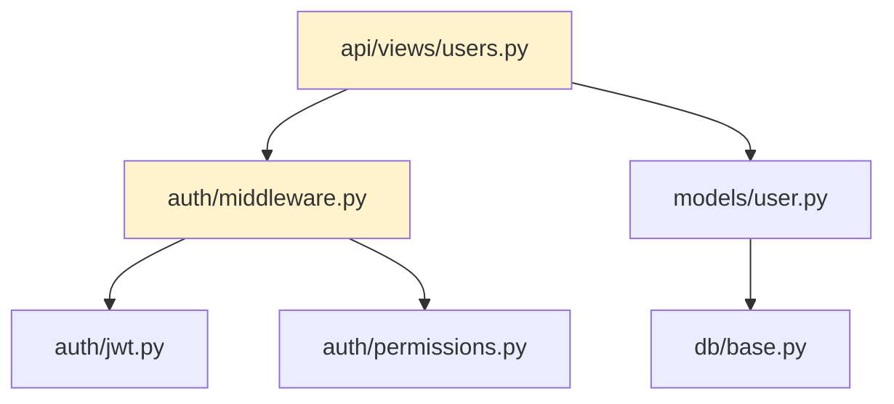
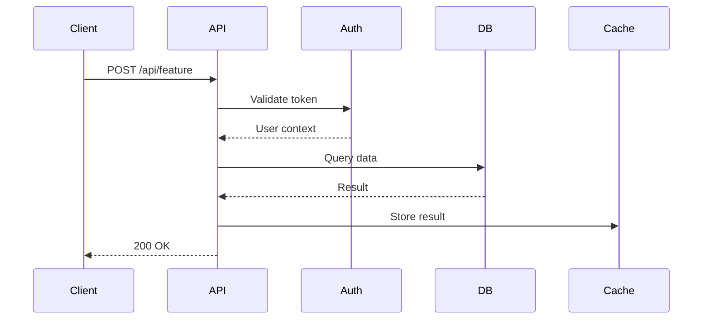
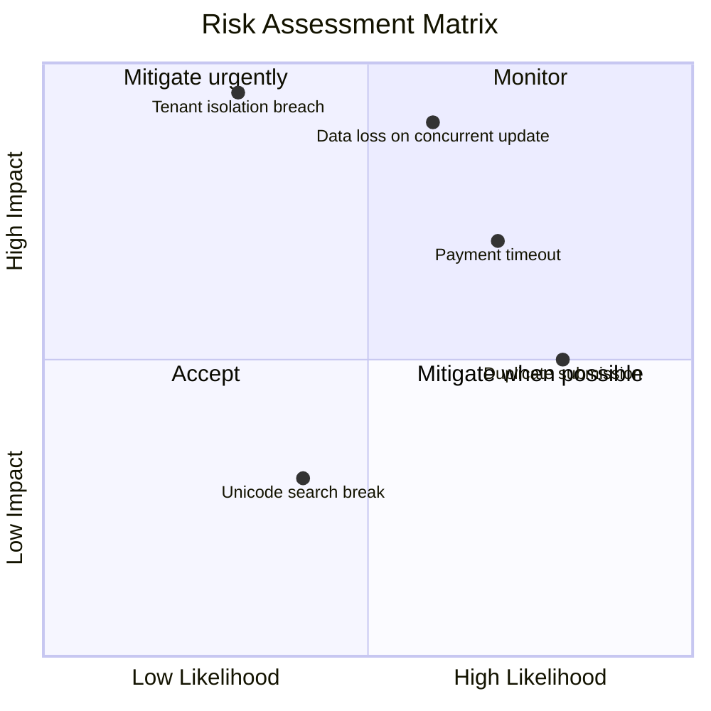
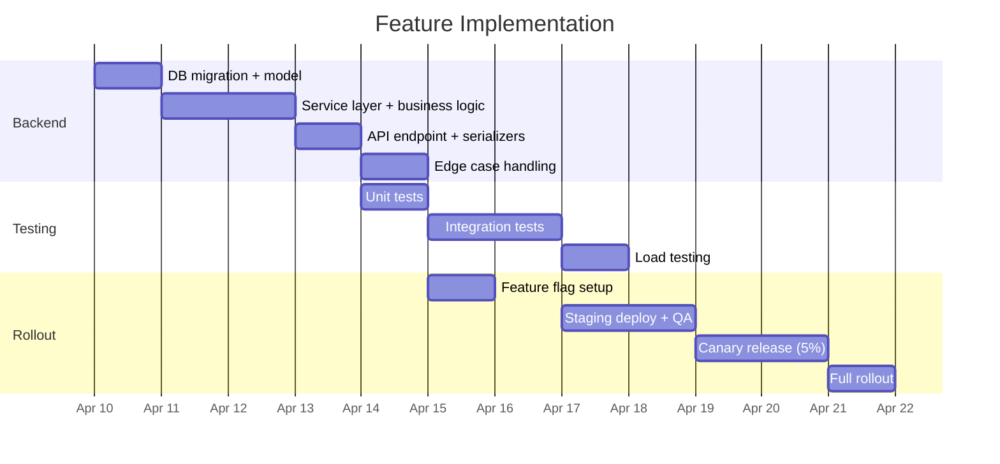

# FDR-{NN}: {Feature Title}

**Date:** {YYYY-MM-DD}
**Status:** Proposed | In Progress | Completed | Abandoned
**Scope:** {backend|frontend|fullstack|api|data}
**Author:** {name/role}
**Related ADRs:** {ADR-XX if applicable}
**Source ADR:** {ADR-XX — the ADR this feature implements, or "—" if standalone}
**Inherits AAC:** {AAC-1, AAC-3 — AAC IDs from source ADR, or "—" if no source ADR}
**Ticket:** {link to issue/ticket if applicable}

---

## Feature Summary

{One paragraph describing what the feature does, who it's for, and why it's needed.}

## Feature Acceptance Criteria

<!-- FACs: Observable behaviors that QA can verify without reading code.
     Each traces to ≥1 AAC from the source ADR (or "—" if no ADR). -->

| ID | Behavior | traces_to_aac | Verification | Priority |
|----|----------|--------------|-------------|----------|
| FAC-{N} | {observable user/system behavior} | {AAC-N or "—"} | {unit / integration / e2e / manual} | {P0/P1/P2} |

<!-- FLOW FRAGMENT: If lite flow, insert Lite Invariants from references/flow-lite.md here.
     If full flow, FAC traces_to_aac has real AAC IDs per references/flow-full.md. -->

## Current State

{How things work today in the area this feature touches. Reference specific code.}

### Dependency Graph

Mermaid source

## Proposed Implementation

{Detailed description of how the feature works. Technical, not conceptual.}

### Data Flow

Mermaid source

### Affected Code Paths

<!-- FDR-REQ-3: Line numbers + current signatures so test mocks match reality. -->

| File | Line Range | Change | Type | Current Signature |
|------|-----------|--------|------|-------------------|
| `api/views/users.py` | 45–89 | Add new endpoint handler | New | — |
| `models/user.py` | 12 | Add `last_feature_use` field | Modify | `class User(Model): ...` |
| `auth/permissions.py` | 30 | Add `CanUseFeature` permission | New | — |
| `tests/test_users.py` | — | Update user creation tests | Modify | — |
| `migrations/0042_add_feature.py` | — | New migration | New | — |

### New Components

- `api/views/feature.py` — endpoint handler with input validation
- `services/feature_service.py` — business logic layer
- `serializers/feature.py` — request/response serialization
- `tests/test_feature.py` — unit and integration tests

### Function Contracts

<!-- FDR-REQ-1: Exact signatures for all new and modified functions.
     Test writers use these to write red-phase tests before implementation exists. -->

| Function | Module | Signature | Pure | Description |
|----------|--------|-----------|------|-------------|
| `{function_name}` | `{file_path}` | `{exact TS/Python signature with param types and return type}` | {Yes/No} | {what it computes} |

### State Transition I/O Tables

<!-- FDR-REQ-2: Each row becomes one test case directly.
     The "→ TC" column is back-filled when the TP is generated, or left as "—". -->

#### {Function/Component Name}

| Row | Input State | Action / Input | Output State | Side Effects | → TC |
|-----|------------|---------------|-------------|-------------|------|
| B-{N} | {initial state} | {action or input value} | {expected result state} | {side effects or "none"} | {TC-N or "—"} |

<!-- SCOPE FRAGMENT: If frontend or fullstack, insert Wireframes + UI Component Props
     from references/scope-frontend.md here (between I/O Tables and Canonical Test Fixtures). -->

### Canonical Test Fixtures

<!-- FDR-REQ-6: Shared data fixtures that both tests and implementation import.
     Establishes a common vocabulary — no ambiguity about test data shapes. -->

| Fixture ID | Name | Shape | Used By | Definition |
|-----------|------|-------|---------|-----------|
| FIX-{N} | `{fixture_name}` | `{type shape or data structure}` | {tests + impl} | `{inline definition or path to shared fixture file}` |

## Edge Cases

### Input Boundaries

<!-- FDR-REQ-4: Each edge case includes concrete test data with unique IDs. -->

| # | Scenario | What Goes Wrong | Handling | Severity | Test Data |
|---|----------|----------------|----------|----------|-----------|
| E1 | Empty request body | 500 with NoneType error at `views.py:52` | Pydantic/Zod validation rejects before handler | medium | `body={}` |
| E2 | Name field > 255 chars | DB constraint violation, unhandled | Add `max_length=255` validation in serializer | medium | `name="a"*256` |
| E3 | Unicode in name field (emoji, CJK) | Works but search index breaks on `search.py:89` | Add unicode normalization before indexing | high | `name="测试🎉"` |
| E4 | Negative quantity value | Business logic produces negative total | Add `ge=0` constraint in request model | high | `quantity=-1` |

### Concurrency

| # | Scenario | What Goes Wrong | Handling | Severity | Test Data |
|---|----------|----------------|----------|----------|-----------|
| E5 | Duplicate submission (double-click) | Two records created | Idempotency key in request header, check before insert | high | `idempotency_key="idem-001", payload={...}` — send twice |
| E6 | Parallel updates to same resource | Last-write-wins, silent data loss | Add optimistic locking with version field | critical | `resource_id="r-001", version=1` — two concurrent PUTs |
| E7 | Read during write (stale cache) | User sees old data after mutation | Invalidate cache key on write, add `Cache-Control: no-cache` on mutation response | medium | `GET /resource/r-001` during concurrent PUT |

### Authorization

| # | Scenario | What Goes Wrong | Handling | Severity | Test Data |
|---|----------|----------------|----------|----------|-----------|
| E8 | User accesses another tenant's data | Data leak across tenants | Add tenant_id filter on every query, test with multi-tenant fixture | critical | `user_tenant="t-001", target_tenant="t-002"` |
| E9 | Expired token during long operation | 401 mid-operation, partial state | Validate token at start AND before commit | high | `token_expiry=now()-1s, operation_duration=5s` |

### External Dependencies

| # | Scenario | What Goes Wrong | Handling | Severity | Test Data |
|---|----------|----------------|----------|----------|-----------|
| E10 | Payment API timeout (>30s) | User sees spinner forever | Set 10s timeout, return 202 + async processing | high | Mock: `payment_api.delay=31s` |
| E11 | Email service returns 429 | Registration fails even though user was created | Decouple: create user first, queue email, retry | medium | Mock: `email_api.status=429` |

### Scale

| # | Scenario | What Goes Wrong | Handling | Severity | Test Data |
|---|----------|----------------|----------|----------|-----------|
| E12 | 10x current users hit endpoint | DB connection pool exhausted | Configure pool size, add read replica for reads | high | Load: `concurrent_users=1000, rps=500` |
| E13 | Large payload (10MB file upload) | Memory spike, OOM in container | Stream processing, 5MB limit with 413 response | medium | `file_size=10_485_760` (10MB) |

## Risk Assessment

### Risk Matrix

Mermaid source

### Risk Register

| # | Risk | Likelihood | Impact | Score | Mitigation | Residual Risk | Owner |
|---|------|-----------|--------|-------|------------|---------------|-------|
| R1 | Data loss on concurrent update | Possible — multiple users edit same resource | Major — silent data loss, no recovery | **High** | Optimistic locking with version field + conflict response | Low — user retries with fresh data | Backend team |
| R2 | Tenant isolation breach | Unlikely — requires missing filter | Catastrophic — data leak, compliance violation | **Critical** | Tenant filter on every query + integration test per endpoint | Very low — caught by tests | Security team |
| R3 | Payment API timeout | Likely — 3rd party, no SLA guarantee | Moderate — user cannot complete purchase | **High** | 10s timeout + async processing + retry queue | Low — user gets email confirmation later | Backend team |
| R4 | Duplicate submission | Likely — no idempotency on form | Minor — duplicate records, confusing UX | **Medium** | Idempotency key header + unique constraint | Very low — duplicates rejected at DB level | Frontend team |

### Risks to Existing Codebase

<!-- Assess what the new feature could break in existing code.
     This is distinct from feature-specific risks — it focuses on regressions and side effects. -->

| # | Category | Affected Code | Current Consumers | Breakage Scenario | Mitigation | Severity |
|---|----------|--------------|-------------------|-------------------|------------|----------|
| RC-{N} | {regression / contract break / perf degradation / dependency conflict / data migration / shared state} | `{file}:{lines}` | {who depends on this code} | {what breaks and how} | {backward-compat shim / migration / feature flag / etc.} | {critical/high/medium/low} |

### Backward Compatibility

| Area | Breaking? | Impact | Migration |
|------|-----------|--------|-----------|
| REST API | No — new endpoint, existing unchanged | None | N/A |
| Database | Yes — new column with NOT NULL | Existing rows need default | Migration with default value, backfill script |
| Client SDK | No — additive change | Older clients don't see new field | N/A |
| Cached data | Yes — cache shape changes | Stale cache returns old format | Version cache keys, invalidate on deploy |

## Testing Strategy

### New Tests Required

| Test | Type | What It Covers | Priority |
|------|------|---------------|----------|
| `test_feature_create_success` | Unit | Happy path creation | P0 |
| `test_feature_create_validation` | Unit | Input validation (E1-E4) | P0 |
| `test_feature_concurrent_update` | Integration | Optimistic locking (E6) | P0 |
| `test_feature_tenant_isolation` | Integration | Cross-tenant access denied (E8) | P0 |
| `test_feature_duplicate_submission` | Integration | Idempotency key (E5) | P1 |
| `test_feature_payment_timeout` | Integration | Timeout handling (E10) | P1 |
| `test_feature_large_payload` | Integration | Size limit (E13) | P2 |
| `test_feature_load` | Load | 10x concurrent users (E12) | P2 |

### Existing Tests Affected

| Test File | Change Needed | Reason |
|-----------|--------------|--------|
| `tests/test_users.py:34` | Update user factory | New field `last_feature_use` |
| `tests/test_api.py:120` | Add auth header | New permission check |
| `tests/conftest.py` | Add feature fixtures | Shared test data |

## Implementation Plan

### Timeline

Mermaid source

### Steps

| # | Step | Files | Depends On | Effort |
|---|------|-------|-----------|--------|
| 1 | DB migration + model update | `models/`, `migrations/` | — | 0.5d |
| 2 | Service layer with business logic | `services/feature_service.py` | Step 1 | 1d |
| 3 | API endpoint + request/response models | `api/views/`, `serializers/` | Step 2 | 1d |
| 4 | Edge case handling (validation, idempotency, locking) | Steps 2-3 files | Step 3 | 1d |
| 5 | Unit + integration tests | `tests/` | Step 4 | 2d |
| 6 | Feature flag + staging deploy | `config/`, deployment | Step 5 | 0.5d |
| 7 | QA + canary rollout | — | Step 6 | 3d |

**Total estimated effort:** ~9 days (5 dev + 2 test + 2 rollout)

### Rollout Plan

| Phase | % Users | Duration | Success Criteria | Rollback Trigger |
|-------|---------|----------|-----------------|-----------------|
| Canary | 5% | 2 days | Error rate < 0.1%, P95 < 500ms | Error rate > 1% OR P95 > 2s |
| Gradual | 25% | 2 days | Same as above | Same |
| Gradual | 50% | 1 day | Same | Same |
| Full | 100% | — | — | — |

**Feature flag:** `ENABLE_FEATURE_X=true` in environment config
**Rollback procedure:** Set `ENABLE_FEATURE_X=false`, deploy. No data migration rollback needed (new column is additive).

### Observability

| Type | What | Where |
|------|------|-------|
| **Metric** | `feature_x_requests_total` (counter) | Prometheus/Datadog |
| **Metric** | `feature_x_latency_seconds` (histogram) | Prometheus/Datadog |
| **Metric** | `feature_x_errors_total` by error type | Prometheus/Datadog |
| **Log** | `feature_x.created` with user_id, tenant_id | Structured logging |
| **Log** | `feature_x.failed` with error, context | Structured logging |
| **Alert** | Error rate > 1% for 5 minutes | PagerDuty/Slack |
| **Alert** | P95 latency > 2s for 5 minutes | PagerDuty/Slack |
| **Dashboard** | Feature X adoption, error rate, latency | Grafana/Datadog |

## References

- {Related ADR} — e.g., "ADR-05: Chose PostgreSQL as primary database"
- {Design doc} — e.g., "RFC: Multi-tenant caching strategy"
- {External docs} — e.g., "Stripe API idempotency: https://stripe.com/docs/api/idempotent_requests"

---

**Downstream documents:**
- TP: {TP-{NN} or "—"}
- IMPL: {IMPL-{NN} or "—"}
- TODO: {TODO-{NN} or "—"}
