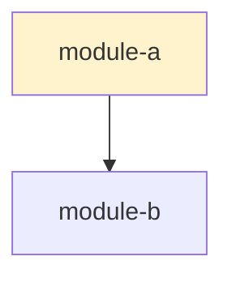
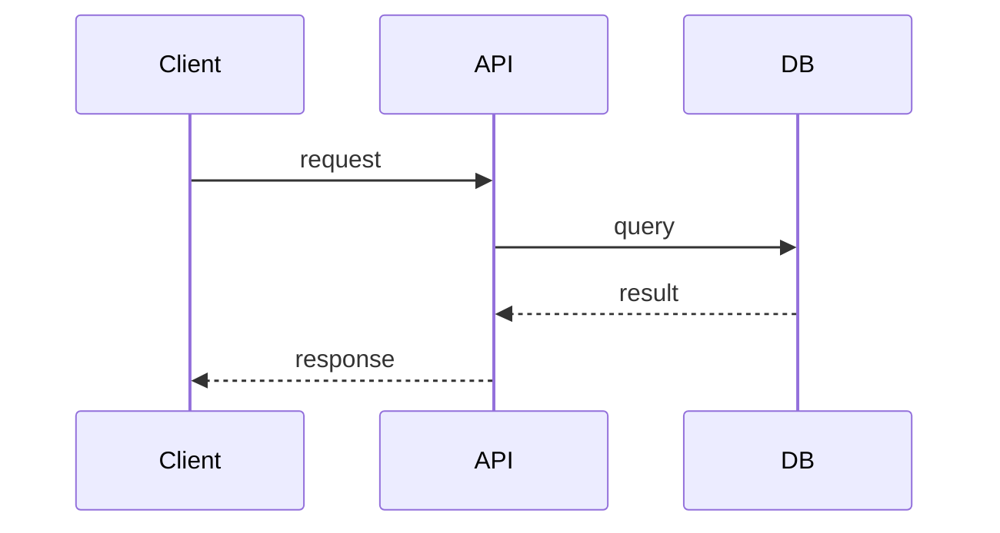
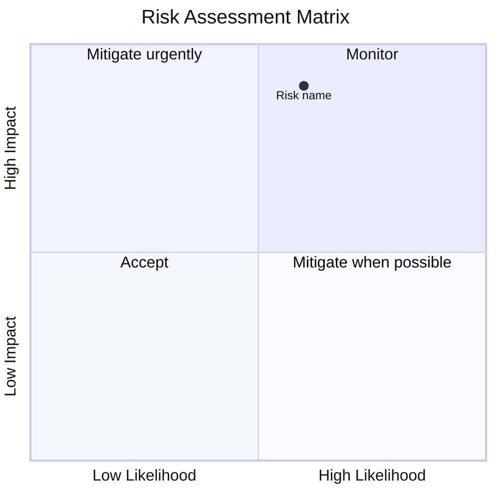
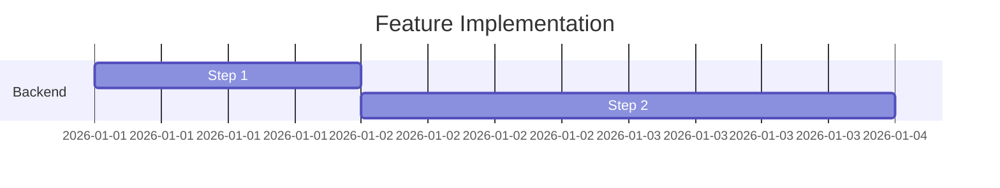

# FDR-{NN}: {Feature Title}

**Date:** {YYYY-MM-DD}
**Status:** Proposed | In Progress | Completed | Abandoned
**Scope:** {backend|frontend|fullstack|api|data}
**Author:** {name/role}
**Related ADRs:** {ADR-XX if applicable}
**Source ADR:** {ADR-XX — the ADR this feature implements, or "—" if standalone}
**Inherits AAC:** {AAC-1, AAC-3 — AAC IDs from source ADR, or "—" if no source ADR}
**Ticket:** {link to issue/ticket if applicable}

---

## Feature Summary

{One paragraph describing what the feature does, who it's for, and why it's needed.}

## Feature Acceptance Criteria

<!-- FACs: Observable behaviors that QA can verify without reading code.
     Each traces to ≥1 AAC from the source ADR (or "—" if no ADR). -->

| ID | Behavior | traces_to_aac | Verification | Priority |
|----|----------|--------------|-------------|----------|
| FAC-{N} | {observable user/system behavior} | {AAC-N or "—"} | {unit / integration / e2e / manual} | {P0/P1/P2} |

<!-- FLOW FRAGMENT: If lite flow, insert Lite Invariants from references/flow-lite.md here.
     If full flow, FAC traces_to_aac has real AAC IDs per references/flow-full.md. -->

## Current State

{How things work today in the area this feature touches. Reference specific code.}

### Dependency Graph

## Proposed Implementation

{Detailed description of how the feature works. Technical, not conceptual.}

### Data Flow

### Affected Code Paths

<!-- FDR-REQ-3: Line numbers + current signatures so test mocks match reality. -->

| File | Line Range | Change | Type | Current Signature |
|------|-----------|--------|------|-------------------|
| `{file}` | {start–end} | {description} | {New/Modify} | {current signature or "—"} |

### New Components

- `{file}` — {purpose}

### Function Contracts

<!-- FDR-REQ-1: Exact signatures for all new and modified functions.
     Test writers use these to write red-phase tests before implementation exists. -->

| Function | Module | Signature | Pure | Description |
|----------|--------|-----------|------|-------------|
| `{function_name}` | `{file_path}` | `{exact signature with param types and return type}` | {Yes/No} | {what it computes} |

### State Transition I/O Tables

<!-- FDR-REQ-2: Each row becomes one test case directly.
     The "→ TC" column is back-filled when the TP is generated, or left as "—". -->

#### {Function/Component Name}

| Row | Input State | Action / Input | Output State | Side Effects | → TC |
|-----|------------|---------------|-------------|-------------|------|
| B-{N} | {initial state} | {action or input value} | {expected result state} | {side effects or "none"} | {TC-N or "—"} |

<!-- SCOPE FRAGMENT: If frontend or fullstack, insert Wireframes + UI Component Props
     from references/scope-frontend.md here (between I/O Tables and Canonical Test Fixtures). -->

### Canonical Test Fixtures

<!-- FDR-REQ-6: Shared data fixtures that both tests and implementation import.
     Establishes a common vocabulary — no ambiguity about test data shapes. -->

| Fixture ID | Name | Shape | Used By | Definition |
|-----------|------|-------|---------|-----------|
| FIX-{N} | `{fixture_name}` | `{type shape or data structure}` | {tests + impl} | `{inline definition or path to shared fixture file}` |

## Edge Cases

<!-- FDR-REQ-4: Each edge case includes concrete test data with unique IDs.
     Organize by category. One example row per category shown; generate all relevant cases. -->

<!-- Categories: Input boundaries, Concurrency, State transitions, Authorization,
     Data integrity, External dependencies, Backward compatibility, Scale.
     Group rows by category using subheadings or sequential numbering. -->

| # | Category | Scenario | What Goes Wrong | Handling | Severity | Test Data |
|---|----------|----------|----------------|----------|----------|-----------|
| E{N} | {category} | {scenario} | {failure mode} | {handling strategy} | {critical/high/medium/low} | `{concrete test input}` |

## Risk Assessment

### Risk Matrix

### Risk Register

| # | Risk | Likelihood | Impact | Score | Mitigation | Residual Risk | Owner |
|---|------|-----------|--------|-------|------------|---------------|-------|
| R{N} | {risk description} | {rare/unlikely/possible/likely/certain — with reasoning} | {negligible/minor/moderate/major/catastrophic — with reasoning} | {Low/Medium/High/Critical} | {concrete mitigation action} | {residual after mitigation} | {team/role} |

### Risks to Existing Codebase

<!-- Assess what the new feature could break in existing code.
     This is distinct from feature-specific risks — it focuses on regressions and side effects. -->

| # | Category | Affected Code | Current Consumers | Breakage Scenario | Mitigation | Severity |
|---|----------|--------------|-------------------|-------------------|------------|----------|
| RC-{N} | {regression / contract break / perf degradation / dependency conflict / data migration / shared state} | `{file}:{lines}` | {who depends on this code} | {what breaks and how} | {mitigation strategy} | {critical/high/medium/low} |

### Backward Compatibility

| Area | Breaking? | Impact | Migration |
|------|-----------|--------|-----------|
| {area} | {Yes/No} | {impact description} | {migration strategy or "N/A"} |

## Testing Strategy

### New Tests Required

| Test | Type | What It Covers | Priority |
|------|------|---------------|----------|
| `{test_name}` | {Unit/Integration/E2E/Load} | {what it covers, reference edge cases} | {P0/P1/P2} |

### Existing Tests Affected

| Test File | Change Needed | Reason |
|-----------|--------------|--------|
| `{file}:{line}` | {change description} | {reason} |

## Implementation Plan

### Timeline

### Steps

| # | Step | Files | Depends On | Effort |
|---|------|-------|-----------|--------|
| 1 | {step description} | `{files}` | {dependency or "—"} | {effort} |

**Total estimated effort:** {N days breakdown}

### Rollout Plan

| Phase | % Users | Duration | Success Criteria | Rollback Trigger |
|-------|---------|----------|-----------------|-----------------|
| Canary | 5% | 2 days | {criteria} | {trigger} |

**Feature flag:** `{FLAG_NAME}` in environment config
**Rollback procedure:** {description}

### Observability

| Type | What | Where |
|------|------|-------|
| **Metric** | `{metric_name}` ({type}) | {system} |
| **Log** | `{event_name}` with {fields} | Structured logging |
| **Alert** | {condition} | {system} |
| **Dashboard** | {what it shows} | {system} |

## References

- {Related documents, external docs, RFCs}

---

**Downstream documents:**
- TP: {TP-{NN} or "—"}
- IMPL: {IMPL-{NN} or "—"}
- TODO: {TODO-{NN} or "—"}
