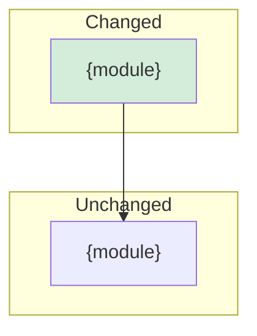

# REC-{NN}: {Feature/Change Title}

**Date:** {YYYY-MM-DD}
**Branch:** {branch name}
**Session segments:** {count}
**Files changed:** {total} ({N} created, {N} edited, {N} removed)
**Satisfaction rate:** {accepted}/{total prompts} ({%})
**Incomplete requests:** {count}

---

## Traceability

| Document | Link | Status |
|----------|------|--------|
| ADR | [{ADR-XX-title}](../adr/ADR-XX-slug.md) | {Accepted/Proposed} |
| FDR | [{FDR-XX-title}](../fdr/FDR-XX-slug.md) | {In Progress/Completed} |
| IMPL | [{IMPL-XX-title}](../implementation_plans/IMPL-XX-slug.md) | {In Progress/Completed} |

*If no planning documents found, note: "No planning documents found for this implementation."*

### Task Completion (from IMPL)

| Task | Title | Status | Evidence |
|------|-------|--------|----------|
| T{NN} | {title} | {Done/Partial/Not started} | `{file}:{lines}` {action} at [{HH:MM}] |

### FDR Edge Case Coverage

| Edge Case | FDR Ref | Handled | Implementation |
|-----------|---------|---------|----------------|
| E{N}: {name} | FDR-{XX} {section} | {Yes/No} | `{file}:{line}` — {how handled} |

### Risk Mitigation Coverage

| Risk | FDR Ref | Mitigated | Implementation |
|------|---------|-----------|----------------|
| R{N}: {name} | FDR-{XX} R{N} | {Yes/No} | `{file}:{lines}` — {how mitigated} |

## Summary

{One paragraph: what was built, why, and current state.}

## Session Narrative

### Intent Chain

| # | Time | Signal | User Request | Outcome | Files |
|---|------|--------|-------------|---------|-------|
| 1 | [{HH:MM}] | [{TAG}] | {request summary} | {outcome} | {N} {action} |

### Quality Metrics

| Metric | Value |
|--------|-------|
| Total prompts | {N} |
| Accepted on first try | {N}/{total} |
| Revision rounds | {N} |
| Incomplete requests | {N} |
| Questions asked | {N} |
| Satisfaction rate | {%} |

## Session Timeline

<!-- One section per cascade segment. Format: -->

### [{HH:MM}] [{TAG}]

> {Full prompt text from blockquote}

- [{HH:MM:SS}] {Created/Edited} `{file}` L{start}-{end} — {description}

## Changes by Module

### {module_name}/

| File | Lines | Action | Description |
|------|-------|--------|-------------|
| `{file}` | {start}-{end} | {CREATE/EDIT} | {description} |

## Key Decisions Made

- **Decision:** {what was decided}
  - **Reason:** {why}
  - **Evidence:** `{file}:{line}`
  - **FDR deviation:** {if applicable}

## Architecture Impact

## Test Coverage

| Test | File:Line | Covers | Edge Cases |
|------|-----------|--------|-----------|
| {test_name} | `{file}:{lines}` | {what it tests} | {E{N} if applicable} |

## Auto-Generated TODOs (from incomplete prompts)

| ID | Title | Source | Priority | Full Prompt |
|----|-------|--------|----------|-------------|
| T-AUTO-{NN} | {summarized from incomplete prompt} | cascade [{HH:MM}] INCOMPLETE | P1 | "{prompt text}" |

*Auto-generated from cascade segments tagged [INCOMPLETE].*

## Known Gaps

| Gap | Related To | Priority | Next Step |
|-----|-----------|----------|-----------|
| {what's missing} | {FDR-XX E{N} / IMPL T{NN}} | {High/Medium/Low} | {action} |

## Handoff Notes

{Context for the next person: what works, what's incomplete, revision history, gotchas, links to source docs.}
