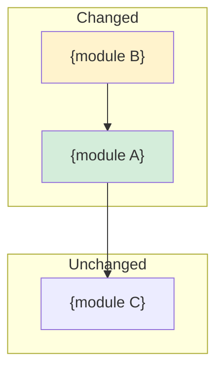

# REC-{NN}: {Feature/Change Title}

**Date:** {YYYY-MM-DD}
**Branch:** {branch name}
**Session segments:** {count}
**Files changed:** {total} ({N} created, {N} edited, {N} removed)
**Satisfaction rate:** {accepted}/{total prompts} ({%})
**Incomplete requests:** {count}

---

## Traceability

| Document | Link | Status |
|----------|------|--------|
| ADR | [{ADR-XX-title}](../adr/ADR-XX-slug.md) | {Accepted/Proposed} |
| FDR | [{FDR-XX-title}](../fdr/FDR-XX-slug.md) | {In Progress/Completed} |
| IMPL | [{IMPL-XX-title}](../implementation_plans/IMPL-XX-slug.md) | {In Progress/Completed} |

*If no planning documents found, note: "No planning documents found for this implementation."*

### Task Completion (from IMPL)

| Task | Title | Status | Evidence |
|------|-------|--------|----------|
| T{NN} | {title} | Done | `{file}:{lines}` {action} at [{HH:MM}] |
| T{NN} | {title} | Partial | {what's done}, {what's missing} |
| T{NN} | {title} | Not started | — |

### FDR Edge Case Coverage

| Edge Case | FDR Ref | Handled | Implementation |
|-----------|---------|---------|----------------|
| E{N}: {name} | FDR-{XX} {section} | Yes | `{file}:{line}` — {how it's handled} |
| E{N}: {name} | FDR-{XX} {section} | No | Not yet implemented |

### Risk Mitigation Coverage

| Risk | FDR Ref | Mitigated | Implementation |
|------|---------|-----------|----------------|
| R{N}: {name} | FDR-{XX} R{N} | Yes | `{file}:{lines}` — {how it's mitigated} |
| R{N}: {name} | FDR-{XX} R{N} | No | Pending {IMPL task} |

## Summary

{One paragraph: what was built, why, and current state.}

## Session Narrative

### Intent Chain

| # | Time | Signal | User Request | Outcome | Files |
|---|------|--------|-------------|---------|-------|
| 1 | [09:20] | [NEW] | Add session caching | Implemented | 2 created |
| 2 | [09:22] | [REVISION] | Missing tenant isolation | Fixed | 2 edits |
| 3 | [09:24] | [ACCEPTED] | Add tests | Implemented | 1 created |
| 4 | [09:26] | [INCOMPLETE] | Concurrent access test missing | NOT DONE | 0 |

### Quality Metrics

| Metric | Value |
|--------|-------|
| Total prompts | {N} |
| Accepted on first try | {N}/{total requests} |
| Revision rounds | {N} |
| Incomplete requests | {N} |
| Questions asked | {N} |
| Satisfaction rate | {accepted}/{total} ({%}) |

## Session Timeline

### [{HH:MM}] [{TAG}]

> {Full prompt text from blockquote — the user's exact words}

- [{HH:MM:SS}] Created `{file}` — {description}
  - `{file}:{lines}` — {specific implementation detail}
- [{HH:MM:SS}] Edited `{file}` L{start}-{end} — {description}

### [{HH:MM}] [{TAG}] {Next user prompt}

> {Full prompt text}

- [{HH:MM:SS}] Edited `{file}` L{start}-{end} — {description}

## Changes by Module

### {module_name}/

| File | Lines | Action | Description |
|------|-------|--------|-------------|
| `{file}` | {start}-{end} | CREATE | {what it does} |
| `{file}` | {start}-{end} | EDIT | {what changed} |

### {another_module}/

| File | Lines | Action | Description |
|------|-------|--------|-------------|
| `{file}` | {line} | EDIT | {what changed} |

## Key Decisions Made

{Decisions made during implementation that deviated from or refined the FDR/ADR. Each with file:line evidence.}

- **Decision:** {what was decided}
  - **Reason:** {why}
  - **Evidence:** `{file}:{line}` — {code that reflects this decision}
  - **FDR deviation:** {how this differs from the plan, if applicable}

## Architecture Impact

Mermaid source

## Test Coverage

| Test | File:Line | Covers | Edge Cases |
|------|-----------|--------|-----------|
| {test_name} | `{file}:{lines}` | {what it tests} | {E{N} if applicable} |

## Auto-Generated TODOs (from incomplete prompts)

| ID | Title | Source | Priority | Full Prompt |
|----|-------|--------|----------|-------------|
| T-AUTO-01 | {summarized from incomplete prompt} | cascade [{HH:MM}] INCOMPLETE | P1 | "{user's exact prompt text}" |

*These TODOs are auto-generated from cascade segments tagged [INCOMPLETE] — user requests that had no subsequent file edits.*

## Known Gaps

| Gap | Related To | Priority | Next Step |
|-----|-----------|----------|-----------|
| {what's missing} | {FDR-XX E{N} / IMPL T{NN}} | {High/Medium/Low} | {action to take} |

## Handoff Notes

{Context for the next person picking this up. Include:}
- What's working and verified
- What's incomplete and why (reference auto-TODOs above)
- Revision history: what was rejected and why (from [REVISION] tags)
- Any gotchas or surprises encountered
- Links to source documents for full context
