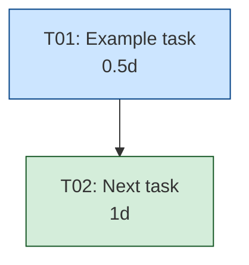

# IMPL-{NN}: {Feature/Decision Title}

**Date:** {YYYY-MM-DD}
**Source:** {FDR-XX-slug.md | ADR-XX-slug.md}
**Source TP:** {TP-XX-slug.md | "—"}
**Method:** {pragmatic|tdd|agile|kanban|shape-up}
**Status:** Planning | In Progress | Completed | Abandoned
**Total effort:** {sum of all tasks} ({critical path duration})
**Parallel tracks:** {number of independent tracks}

---

## Source Summary

{One paragraph summarizing the FDR/ADR — what we're building and why.}

## Engineering Acceptance Criteria

<!-- EACs: Code-level quality gates. Each traces to ≥1 FAC from FDR and ≥1 TC from TP.
     When no TP exists, traces_to_tc uses inline test case IDs (iTC-{N}). -->

| ID | Gate | traces_to_fac | traces_to_tc | Verification | Task |
|----|------|--------------|-------------|-------------|------|
| EAC-{N} | {code-level deliverable statement} | FAC-{N} | {TC-{N} or iTC-{N}} | {unit test / integration test / assertion} | T{NN} |

<!-- FLOW FRAGMENT: If lite flow (Source TP is "—"), insert Inline Test Cases section
     from references/flow-lite.md here. -->

## Task DAG

<!-- Mermaid flowchart with color-coded tracks. Bold critical path edges.
     classDef: foundation=#cce5ff, core=#d4edda, testing=#fff3cd,
     hardening=#f8d7da, observability=#e2d5f1, rollout=#d6d8db -->



## Critical Path

```
T{NN} (Xd) → T{NN} (Xd) → ... → T{NN} (Xd)
```

**Critical path duration:** {N} days
**Total effort (all tracks):** {N} days
**Parallelism savings:** ~{N} days

## Parallel Tracks

| Track | Tasks | Can run in parallel with |
|-------|-------|------------------------|
| {track name} | T{NN}, T{NN} | {other tracks/tasks} |

## Task Details

<!-- Generate one section per task. Every task uses this exact format: -->

#### T{NN}: {Task title}
- **Track:** {foundation|core|testing|hardening|observability|rollout}
- **Depends on:** {T{NN}, T{NN} or "—" for root tasks}
- **Effort:** {0.5d|1d|1.5d|2d}
- **Files:** `{file1}`, `{file2}`
- **Description:** {What exactly to do}
- **Done when:** {Concrete acceptance criteria}
- **Acceptance criteria:** [{EAC-N}] — EAC IDs this task must satisfy
- **Function ref:** {`function_name` from FDR §Function Contracts or "N/A"}
- **Behavior rows:** [{B-N}] from FDR §I/O Tables or "N/A"

## Risk Mitigations from Source

| Risk (from FDR/ADR) | Implemented in Task | Verified in Task |
|---------------------|--------------------|--------------------|
| {R{N}: risk name} | T{NN} ({how}) | T{NN} ({test type}) |

## Summary

| Metric | Value |
|--------|-------|
| Total tasks | {N} |
| Total effort | {N} days |
| Critical path | {N} days |
| Parallel tracks | {N} |
| Root tasks (start immediately) | T{NN}, T{NN} |
| Final task | T{NN} |
| Risk mitigations | {N} |
| Edge cases covered | {N} |
| Tests planned | {N} test tasks |
| EACs defined | {N} |
| Inline TCs | {N (if no TP) or "— (TP exists)"} |
