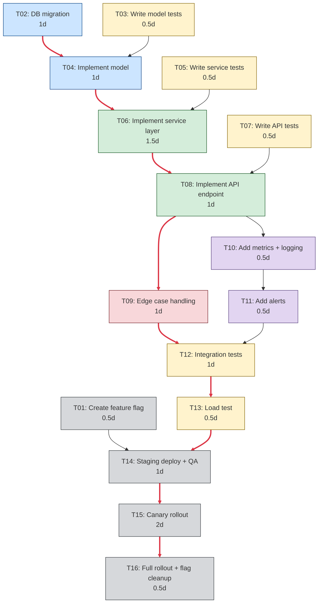

# IMPL-{NN}: {Feature/Decision Title}

**Date:** {YYYY-MM-DD}
**Source:** {FDR-XX-slug.md | ADR-XX-slug.md}
**Method:** {pragmatic|tdd|agile|kanban|shape-up}
**Status:** Planning | In Progress | Completed | Abandoned
**Total effort:** {sum of all tasks} ({critical path duration})
**Parallel tracks:** {number of independent tracks}

---

## Source Summary

{One paragraph summarizing the FDR/ADR — what we're building and why.}

## Task DAG


<details>
<summary>Mermaid source</summary>



</details>

## Critical Path

```
T02 (1d) → T04 (1d) → T06 (1.5d) → T08 (1d) → T09 (1d) → T12 (1d) → T13 (0.5d) → T14 (1d) → T15 (2d) → T16 (0.5d)
```

**Critical path duration:** 10.5 days
**Total effort (all tracks):** 12.5 days
**Parallelism savings:** ~2 days (testing + observability tracks run parallel to core)

## Parallel Tracks

| Track | Tasks | Can run in parallel with |
|-------|-------|------------------------|
| Foundation | T02, T04 | T01 (rollout), T03 (testing) |
| Core | T06, T08 | T05, T07 (testing) |
| Hardening | T09 | T10 (observability) |
| Testing | T03, T05, T07, T12, T13 | Foundation, Core (paired) |
| Observability | T10, T11 | T09 (hardening) |
| Rollout | T01, T14, T15, T16 | Foundation (T01 only) |

## Task Details

### Pre-flight

#### T01: Create feature flag
- **Track:** Rollout
- **Depends on:** — (root task)
- **Effort:** 0.5d
- **Files:** `config/feature_flags.py`, `.env.example`
- **Description:** Add `ENABLE_FEATURE_X` flag with default `false`. Wire into the feature toggle system.
- **Done when:** Flag exists, defaults to off, can be toggled via env var.

### Foundation

#### T02: DB migration + model changes
- **Track:** Foundation
- **Depends on:** — (root task)
- **Effort:** 1d
- **Files:** `models/feature.py`, `migrations/00XX_add_feature.py`
- **Description:** Create the database table/columns from FDR data model section. Add indexes per FDR performance requirements.
- **Done when:** Migration runs cleanly, rollback works, model matches FDR spec.

#### T04: Implement model layer
- **Track:** Foundation
- **Depends on:** T02, T03
- **Effort:** 1d
- **Files:** `models/feature.py`, `models/__init__.py`
- **Description:** Implement model methods, validations, and constraints from FDR. Handle edge cases E1-E4 (input boundaries) at model level.
- **Done when:** T03 tests pass, model validates inputs per FDR edge case table.

### Core

#### T06: Implement service layer
- **Track:** Core
- **Depends on:** T04, T05
- **Effort:** 1.5d
- **Files:** `services/feature_service.py`
- **Description:** Business logic layer. Implement the data flow from FDR design section. Handle concurrency edge cases (E5-E7): idempotency, optimistic locking, cache invalidation.
- **Done when:** T05 tests pass, service handles all FDR edge cases for its layer.

#### T08: Implement API endpoint
- **Track:** Core
- **Depends on:** T06, T07
- **Effort:** 1d
- **Files:** `api/views/feature.py`, `api/serializers/feature.py`, `api/urls.py`
- **Description:** REST endpoint per FDR API section. Request validation, response serialization, auth checks (E8-E9).
- **Done when:** T07 tests pass, API matches FDR contract, auth edge cases handled.

### Testing

#### T03: Write model tests (TDD)
- **Track:** Testing
- **Depends on:** — (root task)
- **Effort:** 0.5d
- **Files:** `tests/test_feature_model.py`
- **Description:** Write failing tests for model layer: CRUD operations, validation, constraints, edge cases E1-E4.
- **Done when:** Tests exist and FAIL (red phase — implementation not yet done).

#### T05: Write service tests (TDD)
- **Track:** Testing
- **Depends on:** T04
- **Effort:** 0.5d
- **Files:** `tests/test_feature_service.py`
- **Description:** Write failing tests for service layer: business logic, concurrency (E5-E7), external deps (E10-E11).
- **Done when:** Tests exist and FAIL.

#### T07: Write API tests (TDD)
- **Track:** Testing
- **Depends on:** T06
- **Effort:** 0.5d
- **Files:** `tests/test_feature_api.py`
- **Description:** Write failing tests for API: endpoint contract, auth (E8-E9), error responses.
- **Done when:** Tests exist and FAIL.

#### T12: Integration tests
- **Track:** Testing
- **Depends on:** T09, T11
- **Effort:** 1d
- **Files:** `tests/integration/test_feature_e2e.py`
- **Description:** End-to-end tests covering full data flow. Include edge cases from FDR that span multiple layers.
- **Done when:** All integration tests pass, cover happy path + top 5 edge cases.

#### T13: Load test
- **Track:** Testing
- **Depends on:** T12
- **Effort:** 0.5d
- **Files:** `tests/load/test_feature_load.py` or `locustfile.py`
- **Description:** Performance test per FDR scale edge cases (E12-E13). Verify P95 latency under expected load.
- **Done when:** P95 < target under 10x expected load.

### Hardening

#### T09: Edge case handling
- **Track:** Hardening
- **Depends on:** T08
- **Effort:** 1d
- **Files:** Multiple (per FDR edge case table)
- **Description:** Implement remaining edge case handlers from FDR: input validation, error responses, retry logic, circuit breakers.
- **Done when:** Every edge case in FDR table has a handler and a test.

### Observability

#### T10: Add metrics + logging
- **Track:** Observability
- **Depends on:** T08
- **Effort:** 0.5d
- **Files:** `services/feature_service.py`, `api/views/feature.py`, `monitoring/metrics.py`
- **Description:** Add counters, histograms, and structured log entries per FDR observability plan.
- **Done when:** Metrics visible in local Prometheus/Grafana, logs appear in structured format.

#### T11: Add alerts
- **Track:** Observability
- **Depends on:** T10
- **Effort:** 0.5d
- **Files:** `monitoring/alerts.yml`, `grafana/dashboards/feature.json`
- **Description:** Configure alerts per FDR: error rate, latency, availability thresholds.
- **Done when:** Alerts fire on simulated failure, dashboard shows feature metrics.

### Rollout

#### T14: Staging deploy + QA
- **Track:** Rollout
- **Depends on:** T01, T13
- **Effort:** 1d
- **Files:** Deployment config, CI/CD pipeline
- **Description:** Deploy to staging with feature flag ON. QA against FDR acceptance criteria.
- **Done when:** QA sign-off, all FDR acceptance criteria verified in staging.

#### T15: Canary rollout
- **Track:** Rollout
- **Depends on:** T14
- **Effort:** 2d (monitoring period)
- **Files:** Feature flag config
- **Description:** Enable for 5% of users. Monitor canary metrics per FDR rollout plan.
- **Done when:** 2 days with error rate < 0.1%, P95 < target. No rollback triggers hit.
- **Rollback trigger:** Error rate > 1% OR P95 > 2x target → set flag to false.

#### T16: Full rollout + cleanup
- **Track:** Rollout
- **Depends on:** T15
- **Effort:** 0.5d
- **Files:** Feature flag config, code cleanup
- **Description:** Ramp to 100%. Remove feature flag conditionals from code. Update documentation.
- **Done when:** Flag removed, code cleaned, docs updated, FDR status set to Completed.

## Post-Launch Checklist

- [ ] Monitor metrics for 1 week post-rollout
- [ ] Conduct retrospective: what worked, what didn't, what surprised us
- [ ] Update FDR status to Completed
- [ ] Archive or remove feature flag code
- [ ] Update API documentation if applicable
- [ ] Share learnings with team

## Risk Mitigations from Source

| Risk (from FDR/ADR) | Implemented in Task | Verified in Task |
|---------------------|--------------------|--------------------|
| {R1: Data loss on concurrent update} | T06 (optimistic locking) | T12 (integration test) |
| {R2: Tenant isolation breach} | T08 (auth checks) | T12 (multi-tenant test) |
| {R3: Payment API timeout} | T09 (circuit breaker) | T13 (load test) |
| {R4: Duplicate submission} | T06 (idempotency key) | T05 (service test) |

## Summary

| Metric | Value |
|--------|-------|
| Total tasks | 16 |
| Total effort | 12.5 days |
| Critical path | 10.5 days |
| Parallel tracks | 6 |
| Root tasks (start immediately) | T01, T02, T03 |
| Final task | T16 |
| Risk mitigations | 4 |
| Edge cases covered | 13 |
| Tests planned | 5 test tasks |
