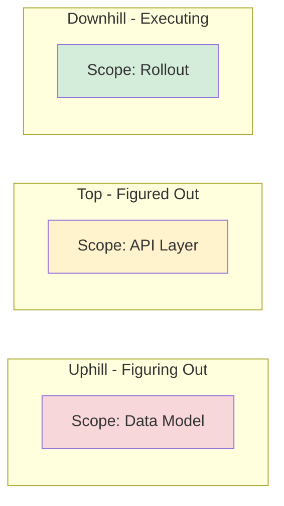

# Shape Up Method Template

Fixed 6-week appetite. Variable scope. Scopes with hill charts.

## Appetite

**Time budget:** {N} weeks
**If over budget:** Cut {nice-to-have scopes} first

## Scopes

Each scope is an independently shippable piece.

```markdown
### Scope: {name}
**Hill position:** Uphill (figuring out) | Top (figured out) | Downhill (executing)
**Tasks:** T{XX}, T{YY}, T{ZZ}
**Nice-to-have:** {yes|no}
**Cut if:** over budget by {N} days
```

## Hill Chart



## Scope Hammer

If running out of time, cut scopes in this order (last = cut first):
1. {Core scope} — must ship
2. {Hardening scope} — should ship
3. {Nice-to-have scope} — cut first
