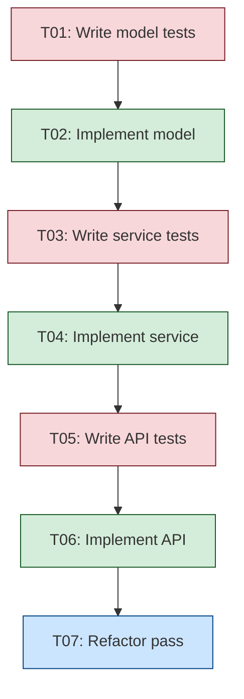

# TDD Method Template

Every implementation task gets a paired test-first task.

## DAG Pattern



## Task Pair Format

```
T{NN}-test: Write failing test for {component}
  Depends on: previous impl task (or root)
  Done when: Tests exist and FAIL

T{NN}-impl: Make tests pass for {component}
  Depends on: T{NN}-test
  Done when: All T{NN}-test tests PASS

T{NN}-refactor: Clean up {component}
  Depends on: T{NN}-impl
  Done when: Tests still pass, code clean
```

## Cycle

```
RED: Write failing test → GREEN: Minimal code to pass → REFACTOR: Clean up
```
