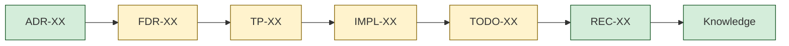

# TRACE-{NN}: {Feature/Decision Title}

**Date:** {YYYY-MM-DD}
**Seed:** {FDR-XX / ADR-XX / query text}
**Mode:** {standard / verify}
**Status:** {READY TO SHIP / NOT READY / NEEDS REVIEW}
**Coverage:** {N}% — {complete}/{total} items verified

---

## Verdict (--verify mode only)

**{READY TO SHIP / NOT READY / NEEDS REVIEW}**

{One paragraph summary: what's complete, what's missing, what blocks shipping.}

High-severity gaps: {count}
Medium-severity gaps: {count}
Low-severity gaps: {count}

---

## Document Chain

<!-- If ADR or TP were not generated, render them with :::na and label "Not generated".
     Missing ADR/TP are never flagged as gaps — they are optional in the chain. -->

| Stage | Document | Status | Link |
|-------|----------|--------|------|
| Decision | {ADR-XX or "Not generated"} | {status} | {link} |
| Feature plan | {FDR-XX} | {status} | {link} |
| Test plan | {TP-XX or "Not generated"} | {status} | {link} |
| Task plan | {IMPL-XX} | {status} | {link} |
| Task tracking | {TODO-XX} | {N/M tasks complete} | {link} |
| Cascade record | {REC-XX or "Missing"} | {status} | {link} |
| Knowledge | {N entries} | {status} | {link} |

## Acceptance Criteria Chain

<!-- Walk the full acceptance hierarchy. Adapt to what exists:
     - Full chain (ADR+TP): AAC → FAC → EAC → TC
     - No ADR: skip AAC → FAC; start at FAC → EAC → TC
     - No TP: use IMPL inline test cases (iTC-) for EAC → TC
     - No ADR + No TP: FAC → EAC → iTC only -->

### AAC → FAC Traceability

<!-- Omit this section if no ADR exists -->

| AAC ID | AAC Invariant | FAC IDs | Coverage |
|--------|-------------|---------|----------|
| AAC-{N} | {invariant} | FAC-{N}, FAC-{M} | {Full/Partial/None} |

### FAC → EAC Traceability

| FAC ID | FAC Behavior | EAC IDs | Coverage |
|--------|-------------|---------|----------|
| FAC-{N} | {behavior} | EAC-{N}, EAC-{M} | {Full/Partial/None} |

### EAC → TC Traceability

| EAC ID | EAC Gate | TC IDs | Status |
|--------|---------|--------|--------|
| EAC-{N} | {gate} | {TC-{N} or iTC-{N}} | {All passing / Some failing / Not implemented} |

### TC → Code Verification

| TC ID | TC Description | Test File | Status | Verified |
|-------|---------------|-----------|--------|----------|
| {TC-{N} or iTC-{N}} | {description} | `{test_file}:{line}` | {passing/failing/not written} | {Yes/No} |

### Full Chain Coverage

| AAC | → FAC | → EAC | → TC | → Code | End-to-End |
|-----|-------|-------|------|--------|-----------|
| {AAC-{N} or "—"} | FAC-{N} | EAC-{N} | {TC/iTC} | {verified/gap} | {Complete / Broken at {stage}} |

## Edge Case Coverage

| # | Edge Case | FDR Ref | IMPL Task | TODO Status | Code Exists | Test Exists | Verified |
|---|-----------|---------|-----------|-------------|-------------|-------------|----------|
| E{N} | {name} | FDR-{XX} | T{NN} | {status} | `{file}:{line}` | `{test}:{line}` | {Yes/No/GAP} |

**Coverage: {N}/{total} edge cases verified ()**

## Task Completion

| Task | IMPL Ref | Track | TODO Status | Cascade Evidence | Code Verified |
|------|----------|-------|-------------|-----------------|---------------|
| T{NN} | {title} | {track} | {status} | [{HH:MM}] `{file}` | {Yes/Partial/GAP} |

**Completion: {N}/{total} tasks done ()**

## Knowledge Applied

| Entry | Type | Relevant | Applied | Where |
|-------|------|----------|---------|-------|
| {ID} | {type} | {Yes} | {Yes/Not applied} | `{file}:{line}` or GAP |

## Gaps Summary

| # | Gap | Severity | Source | Impact | Action Needed |
|---|-----|----------|--------|--------|---------------|
| G{N} | {what's missing} | {High/Medium/Low} | {source ref} | {impact if shipped} | {specific action} |

## Coverage Summary

| Dimension | Covered | Total | Percentage |
|-----------|---------|-------|-----------|
| AAC → FAC coverage | {N} | {total} |  |
| EAC → TC coverage | {N} | {total} |  |
| Edge cases | {N} | {total} |  |
| Tasks complete | {N} | {total} |  |
| Knowledge applied | {N} | {total} | ** |

<!-- Omit AAC → FAC row if no ADR. Use iTC counts if no TP. -->
