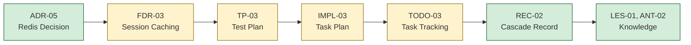

# TRACE-{NN}: {Feature/Decision Title}

**Date:** {YYYY-MM-DD}
**Seed:** {FDR-XX / ADR-XX / query text}
**Mode:** {standard / verify}
**Status:** {READY TO SHIP / NOT READY / NEEDS REVIEW}
**Coverage:** {N}% — {complete}/{total} items verified

---

## Verdict (--verify mode only)

**{READY TO SHIP / NOT READY / NEEDS REVIEW}**

{One paragraph summary: what's complete, what's missing, what blocks shipping.}

High-severity gaps: {count}
Medium-severity gaps: {count}
Low-severity gaps: {count}

---

## Document Chain

Mermaid source

<!-- If ADR or TP were not generated, render them with :::na and label "Not generated".
     Missing ADR/TP are never flagged as gaps — they are optional in the chain. -->

| Stage | Document | Status | Link |
|-------|----------|--------|------|
| Decision | {ADR-XX-title} | {Accepted/Proposed/Not generated} | [Link](../adr/ADR-XX.md) |
| Feature plan | {FDR-XX-title} | {Complete/In Progress/Missing} | [Link](../fdr/FDR-XX.md) |
| Test plan | {TP-XX-title} | {Complete/Draft/Not generated} | [Link](../test_plans/TP-XX.md) |
| Task plan | {IMPL-XX-title} | {Complete/In Progress/Missing} | [Link](../implementation_plans/IMPL-XX.md) |
| Task tracking | {TODO-XX-title} | {N/M tasks complete} | [Link](../todos/TODO-XX.yaml) |
| Cascade record | {REC-XX-title} | {Exists/Missing} | [Link](../cascades/REC-XX.md) |
| Knowledge | {N entries} | {Extracted/Pending} | [Index](../knowledge/index.yaml) |

## Acceptance Criteria Chain

<!-- Walk the full acceptance hierarchy. Adapt to what exists in the chain:
     - Full chain (ADR+TP): AAC → FAC → EAC → TC
     - No ADR: skip AAC → FAC; start at FAC → EAC → TC
     - No TP: use IMPL inline test cases (iTC-) for EAC → TC
     - No ADR + No TP: FAC → EAC → iTC only -->

### AAC → FAC Traceability

<!-- Omit if no ADR exists -->

| AAC ID | AAC Invariant | FAC IDs | Coverage |
|--------|-------------|---------|----------|
| AAC-{N} | {invariant from ADR} | FAC-{N}, FAC-{M} | {Full/Partial/None} |

### FAC → EAC Traceability

| FAC ID | FAC Behavior | EAC IDs | Coverage |
|--------|-------------|---------|----------|
| FAC-{N} | {behavior from FDR} | EAC-{N}, EAC-{M} | {Full/Partial/None} |

### EAC → TC Traceability

| EAC ID | EAC Gate | TC IDs | Status |
|--------|---------|--------|--------|
| EAC-{N} | {gate from IMPL} | {TC-{N} or iTC-{N}} | {All passing / Some failing / Not implemented} |

### TC → Code Verification

| TC ID | TC Description | Test File | Status | Verified |
|-------|---------------|-----------|--------|----------|
| {TC-{N} or iTC-{N}} | {description} | `{test_file}:{line}` | {passing/failing/not written} | {Yes/No} |

### Full Chain Coverage

| AAC | → FAC | → EAC | → TC | → Code | End-to-End |
|-----|-------|-------|------|--------|-----------|
| {AAC-{N} or "—"} | FAC-{N} | EAC-{N} | {TC-{N} or iTC-{N}} | {verified/gap} | {Complete / Broken at {stage}} |

## Edge Case Coverage

| # | Edge Case | FDR Ref | IMPL Task | TODO Status | Code Exists | Test Exists | Verified |
|---|-----------|---------|-----------|-------------|-------------|-------------|----------|
| E1 | {name} | FDR-{XX} | T{NN} | {status} | `{file}:{line}` | `{test}:{line}` | Yes/No |
| E5 | {name} | FDR-{XX} | T{NN} | {status} | `{file}:{line}` | `{test}:{line}` | Yes/No |
| E6 | {name} | FDR-{XX} | T{NN} | **Not started** | **MISSING** | **MISSING** | **GAP** |

**Coverage: {N}/{total} edge cases verified ({percentage}%)**

## Risk Mitigation Coverage

| # | Risk | FDR Ref | Severity | IMPL Task | Mitigated | Code Evidence | Verified |
|---|------|---------|----------|-----------|-----------|---------------|----------|
| R1 | {name} | FDR-{XX} | {High/Med/Low} | T{NN} | Yes/No | `{file}:{line}` | Yes/No |
| R2 | {name} | FDR-{XX} | {severity} | T{NN} | **NO** | **MISSING** | **GAP** |

**Coverage: {N}/{total} risks mitigated ({percentage}%)**

## Task Completion

| Task | IMPL Ref | Track | TODO Status | Cascade Evidence | Code Verified |
|------|----------|-------|-------------|-----------------|---------------|
| T02 | {title} | {track} | Complete | [{HH:MM}] `{file}` | Yes — file exists, {N} lines |
| T06 | {title} | {track} | In Progress | [{HH:MM}] `{file}` | Partial — {N}/{M} functions |
| T09 | {title} | {track} | **Blocked** | No entry | **GAP** |

**Completion: {N}/{total} tasks done ({percentage}%)**

## Test Coverage

| Test | File:Line | IMPL Task | Edge Cases | Status |
|------|-----------|-----------|-----------|--------|
| {test_name} | `{file}:{line}` | T{NN} | E{N} | Passing |
| {test_name} | `{file}:{line}` | T{NN} | E{N} | Failing |
| **MISSING** | — | T{NN} | E{N} | **Not written** |

**Coverage: {N}/{total} test tasks have tests ({percentage}%)**

## Knowledge Applied

| Entry | Type | Relevant | Applied | Where |
|-------|------|----------|---------|-------|
| {LES-01} | Lesson | Yes | Yes | `{file}:{line}` |
| {ANT-02} | Antipattern | Yes | Yes | `{file}:{line}` |
| {PAT-01} | Pattern | Yes | **Not applied** | **GAP** |

## Gaps Summary

| # | Gap | Severity | Source | Impact | Action Needed |
|---|-----|----------|--------|--------|---------------|
| G1 | {what's missing} | High | {FDR-XX E{N}} | {impact if shipped} | {specific action} |
| G2 | {what's missing} | Medium | {IMPL-XX T{NN}} | {impact} | {action} |
| G3 | {what's missing} | Low | — | {impact} | {action} |

## Coverage Summary

| Dimension | Covered | Total | Percentage |
|-----------|---------|-------|-----------|
| AAC → FAC coverage | {N} | {total} |  |
| EAC → TC coverage | {N} | {total} |  |
| Edge cases | {N} | {total} |  |
| Tasks complete | {N} | {total} |  |
| Knowledge applied | {N} | {total} | ** |

<!-- Omit AAC → FAC row if no ADR. Use iTC counts if no TP. -->
